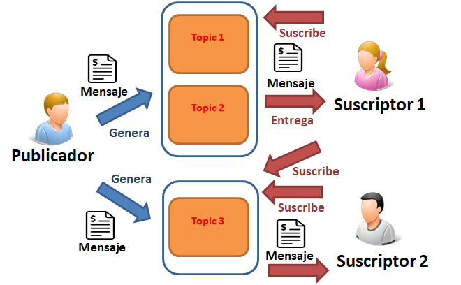
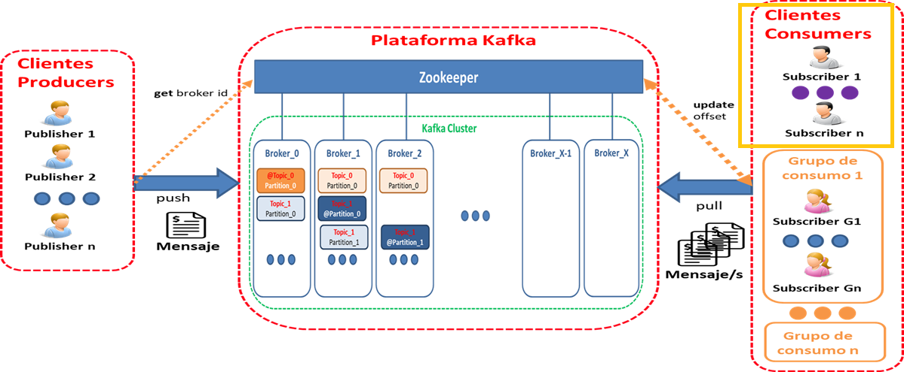

<center>

# Kafka
</center>

## ¿Que es?
Apache Kafka es una plataforma distribuida de transmisión de datos que permite publicar, almacenar y procesar flujos de registros, así como suscribirse a ellos, de forma inmediata. Está diseñada para administrar los flujos de datos de varias fuentes y distribuirlos a diversos usuarios. En pocas palabras, transfiere cantidades enormes de datos, no solo desde el punto A hasta el B, sino también del punto A al Z y a cualquier otro lugar que necesite, y todo al mismo tiempo.

## Componentes
* ### Productores /Producers
Permite que una aplicación pueda publicar mensajes de un topic de forma asíncrona (lo que significa que los puntos de conexión que producen y consumen los mensajes interactúan con la cola, no entre sí). En el caso de que un broker se caiga, el productor sabrá cómo recuperarse y seguirá escribiendo. Además se podrá configurar la recepción de ack para la confirmación de las recepciones.
* ### Consumidores / Consumers
Permite suscribirse a uno o varios topic de Kafka y poder consumir sus mensajes y tratarlos en la aplicación. Los mismos pueden agruparse en grupos.

Tipos de lectura:
* Cola Tradicional : Todos los consumidores pertenecen a un sólo grupo.
* Difusión : Todos los consumidores pertenecen a diferentes grupos.
* Subscripción Lógica : Muchos consumidores son instancias de un grupo.

* ### Brokers
Es un clúster identificado por un ID, que contiene uno o más servidores donde se almacenan las particiones de un topic. Permite replicar y particionar dichos topics balanceando la carga entre los brokers, para que sea escalable y tolerante a fallos.
* ### Mensaje
Cada elemento que se almacena en un topic, son inmutables y se garantiza el orden dentro de una misma partición.
* ### Topico / Topic
Flujo de datos sobre un tema en particular, identificados por un nombre.
* ### Particiones 
Forma en la que se dividen los topic al crearlos.
* ### Conectores / Connectors
Componentes preparados para simplificar la integración con sistemas externos y el clúster de Kafka.
## Gráficos
### Esquema Simple
En la imagen se puede observar como un productor pushea un mensaje a un tópico específico y un consumidor, que esta suscripto al mismo, lo consume (o pullea).

### Esquema Complejo
En la siguiente imagen ya podemos obsevar como interfieren los Broker, el Zookeeper, el cluster y los grupos de consumidores. 


## Configuración Kafka en JAVA
A continuación veremos como crear un productor y un consumidor a un servicio levantado en  [RedPanda](https://redpanda.com/ "Web oficial RedPanda"), el cual es compatible con kafka.

### `Properties`
Es necesario crear un objeto de tipo `Properties` al cual le configuraremos todos los atributos necesarios para realizar la configuración de los productores y consumidores.

Este objeto varía según productor y consumidor, en este caso a modo de ejemplo se utiliza el del productor. 
```java
// Configuraciones para el productor
    Properties props = new Properties();
    props.put("bootstrap.servers", "server");
    props.put("acks", "all");
    // Si la solicitud falla, el productor reintentará automáticamente, incluso si
    // se establece en 0, el productor puede reintentar automáticamente.
    props.put("retries", 0);
    props.put("batch.size", 16384);
    // Enviar inmediatamente por defecto, aquí está el retraso en milisegundos
    props.put("linger.ms", 1);
    // Tamaño del búfer del productor Cuando se agota el búfer, se bloquearán las
    // llamadas de envío adicionales. El tiempo excede el máximo.block.msLanzará
    // TimeoutException
    props.put("buffer.memory", 33554432);
    props.put("key.serializer", "org.apache.kafka.common.serialization.StringSerializer");
    props.put("value.serializer", "org.apache.kafka.common.serialization.StringSerializer");

```

### `Producer`
La función `send` requiere de distintos parámetros, primero el nombre del tópico al cual se envía el mensaje, luego la clave del mensaje y luego el contenido del mismo. 

Por ejemplo:
```java
producer.send(new ProducerRecord<String, String>("test_topic_03", "test1", "Prueba"));
```
`"test_topic_03"` es el tópico.
`test1` es la clave.
`prueba` es el contenido del mensaje.

```java
// Crea un productor
    Producer<String, String> producer = new KafkaProducer<String, String>(props);
    // flush() ; Todos los registros en caché se envían inmediatamente

    // Envio de datos en cantidad
    for (int i = 30; i < 45; i++) { producer.send(new ProducerRecord<String,
    String>("test_topic_01", Integer.toString(i), Integer.toString(i))); }
        

    // Envio un solo dato
    producer.send(new ProducerRecord<String, String>("test_topic_03", "test1", "Prueba"));
```

### `Consumer`
Para el consumidor primero utilizaremos otras configuraciones en nuestro objeto `Properties`, luego llamaremos los mensajes pendientes y los almacenaremos en un array que posteriormente mostramos. 
```java
// Configuraciones para el consumidor
		Properties config = new Properties();
		config.put("bootstrap.servers", "10.40.1.103:9092");
		config.put("group.id", "GroupA"); // Este es GroupA o GroupB
		config.put("enable.auto.commit", "true");
		config.put("auto.commit.interval.ms", "1000");
		config.put("session.timeout.ms", "30000"); // Tiempo de procesamiento de la respuesta de la encuesta
													// (extracción)
		config.put("key.deserializer", "org.apache.kafka.common.serialization.StringDeserializer");
		config.put("value.deserializer", "org.apache.kafka.common.serialization.StringDeserializer");

		// Se crea el consumidor
		KafkaConsumer<String, String> consumer = new KafkaConsumer<String, String>(config);

		// Suscribir el consumidor a los topicos que uno necesite
		consumer.subscribe(Arrays.asList("test_topic_03"));

		// Lectura por parte del consumidor y almacenado en variable
		ConsumerRecords<String, String> records = consumer.poll(100);

		// Se recorre el consumidor con un for
		for (ConsumerRecord<String, String> record : records)
			System.out.printf("offset = %d, key = %s, value = %s", record.offset(), record.key(),
					record.value() + "\n");

		// Se cierra el consumidor
		consumer.close();
```

Webs utilizadas para crear este documento:
* [En Mi Local Funciona](https://www.enmilocalfunciona.io/aprendiendo-apache-kafka-parte-1/), manual sumamente detallado que engloba los conceptos y muestra como ejecutar kafka desde la consola. 
* [Kafka 101: Arquitectura, operaciones y API Clientes](https://www.youtube.com/watch?v=nAJ-qlL0hNs), webinar.
* [Jarroba Apache Kafka, explicación](https://jarroba.com/apache-kafka/).
* [Jarroba Instalar Apache Kafka](https://jarroba.com/instalar-apache-kafka/).
* [Programmer Click, primer contacto con kafka](https://programmerclick.com/article/30431219759/).
* [Kafka Documentación](https://kafka.apache.org/documentation/)
